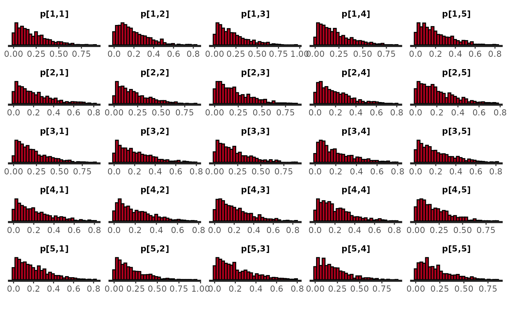
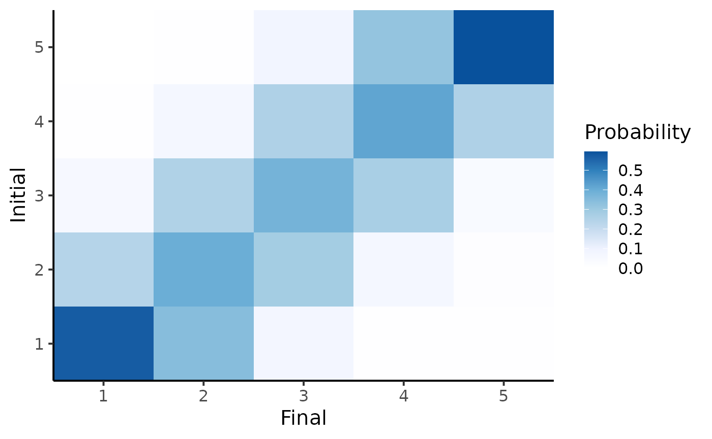
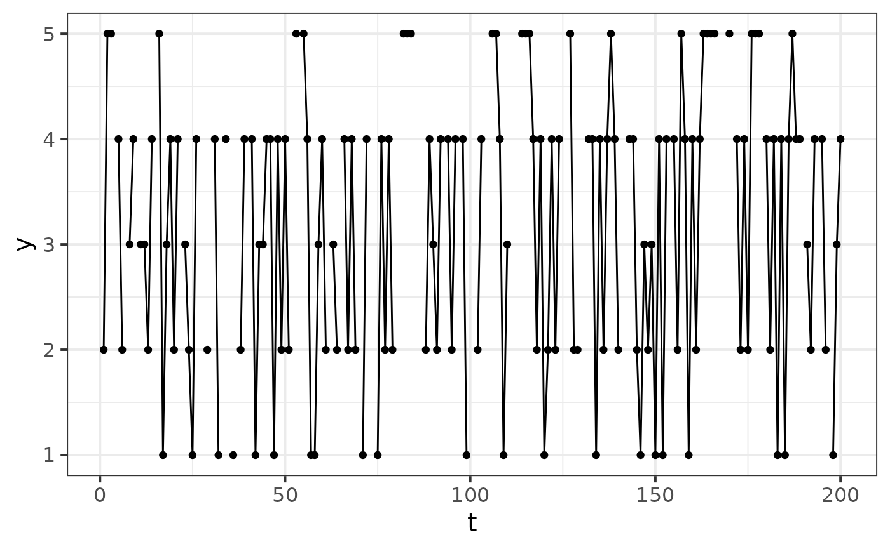
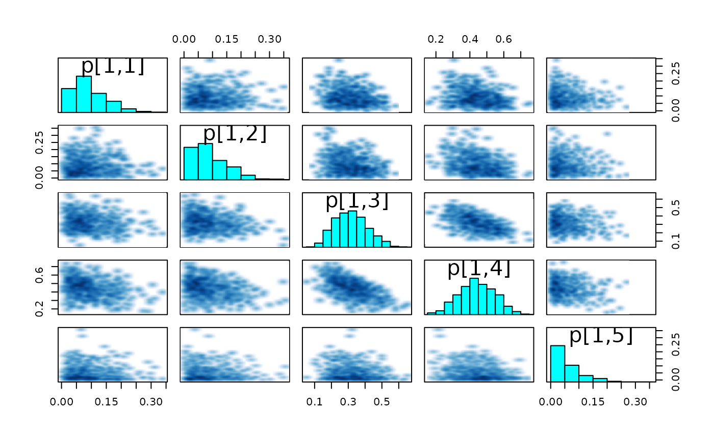
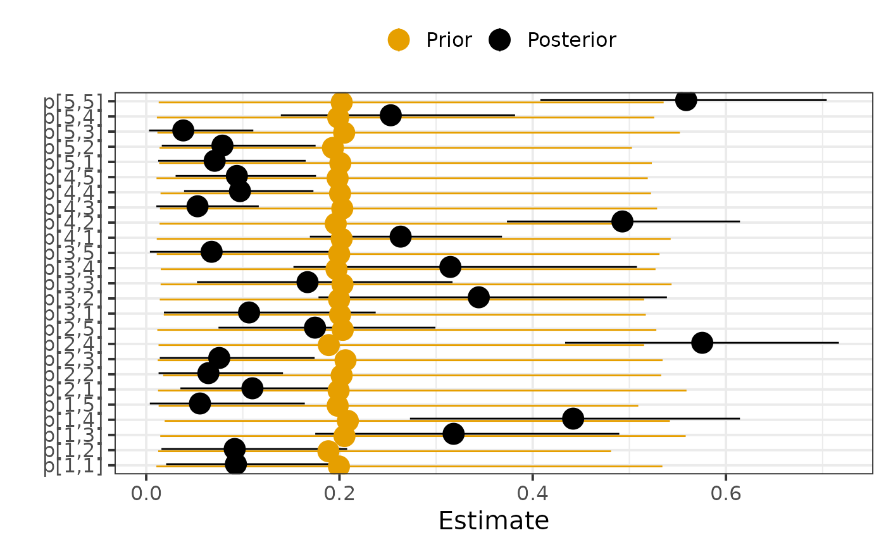
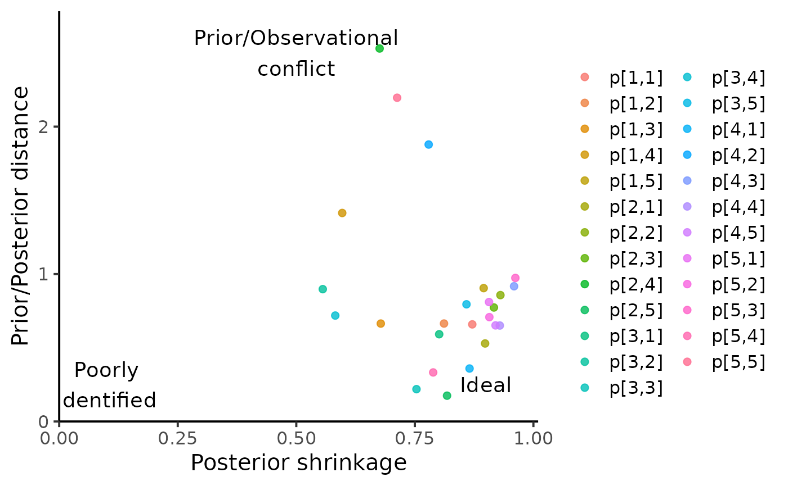
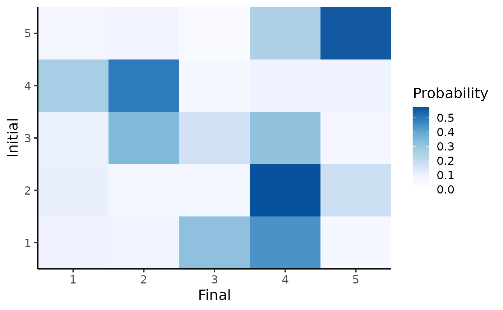
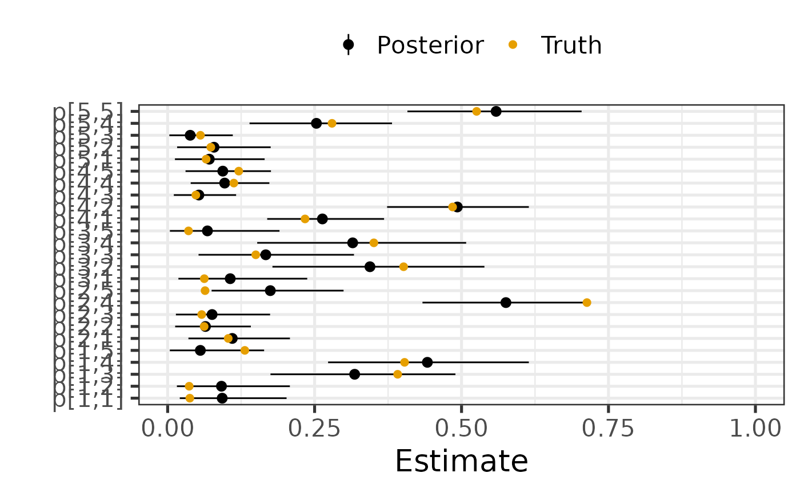
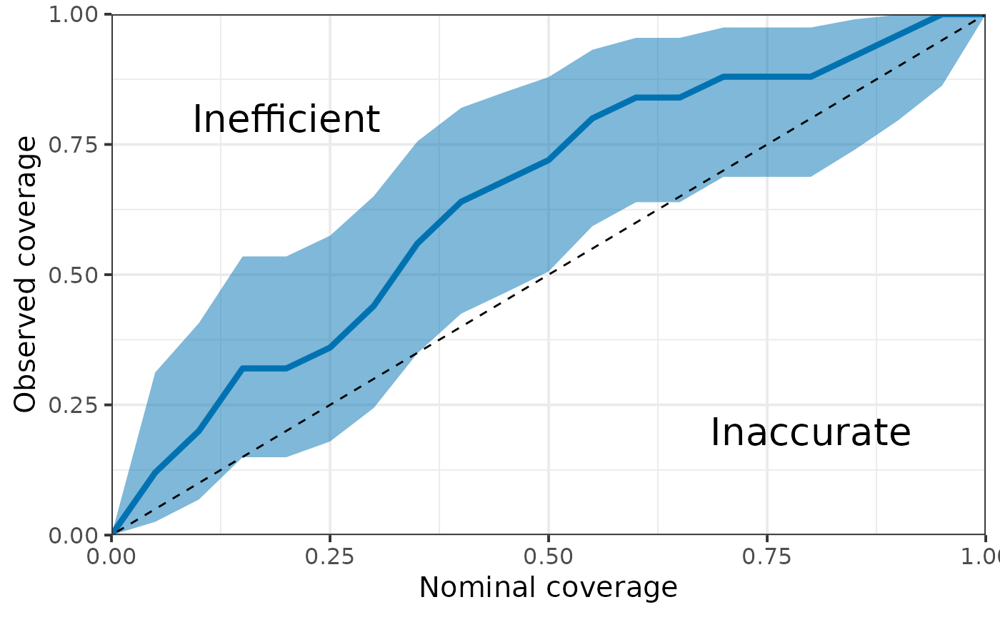

# Markov Chain model

In this example, we will consider a Markov Chain with **K = 5 states**
and generate a time-series of length **t_max = 200**.

``` r
library(EczemaPred)
library(HuraultMisc)
library(dplyr)
library(tidyr)
library(ggplot2)
library(rstan)
options(mc.cores = parallel::detectCores()) # Parallel computing

set.seed(2021) # For reproducibility

model <- EczemaModel("MC", K = params$K)
```

## Prior predictive distribution

The Stan model works with pairs of successive states rather than a
time-series sequence. To generate a time-series from the prior
predictive distribution, we can consider that all possible states at
each time-point.

``` r
df0 <- data.frame(y0 = rep(1:params$K, each = params$t_max),
                  y1 = 1, # does not matter
                  dt = 1)
fit_prior1 <- sample_prior(model, data = df0, chains = 1, refresh = 0)
```

The default prior that we used was a symmetric uniform Dirichlet
distribution (Dirichlet distribution where all concentration parameters
are equal to 1). We can inspect the empirical distribution of the
transition probabilities.

``` r
rstan::plot(fit_prior1, pars = "p", plotfun = "hist")
```



We can also plot the expected transition matrix as an heatmap.

``` r
plot_transition_MC(fit_prior1)
#> Warning: `aes_string()` was deprecated in ggplot2 3.0.0.
#> ℹ Please use tidy evaluation idioms with `aes()`.
#> ℹ See also `vignette("ggplot2-in-packages")` for more information.
#> ℹ The deprecated feature was likely used in the EczemaPred package.
#>   Please report the issue at <https://github.com/ghurault/EczemaPred/issues>.
#> This warning is displayed once every 8 hours.
#> Call `lifecycle::last_lifecycle_warnings()` to see where this warning was
#> generated.
```


If the categories are ordinal, we may assume that the probabilities of
transitioning from state 5 to 1 is much smaller than the probability
from transitioning from state 5 to 4. In that case, we could use an
RBF-like Dirichlet prior for the transition probabilities, for example:

``` r
prior_RBF_MC <- function(K, alpha, l) {
  # RBF-like Dirichlet prior
  # Each transition pmf is normalised to a pseudo-count of K
  #
  # Args:
  # K : number of states
  # alpha: scaling factor, determining the concentration of the Dirichlet distribution
  # l: length scale
  #
  # Returns:
  # K*K matrix
  
  p <- matrix(NA, nrow = K, ncol = K)
  for (i in 1:K) {
    for (j in 1:K) {
      p[i, j] <- exp(-(i - j)^2 / 2 / l^2)
    }
    p[i, ] <- p[i, ] / sum(p[i, ])
  }
  p <- alpha * K * p
  return(list(p = p))
}

model2 <- EczemaModel("MC", K = params$K, prior = prior_RBF_MC(params$K, 1, 1))

fit_prior2 <- sample_prior(model2, data = df0, chains = 1, refresh = 0)
#> Warning: There were 845 divergent transitions after warmup. See
#> https://mc-stan.org/misc/warnings.html#divergent-transitions-after-warmup
#> to find out why this is a problem and how to eliminate them.
#> Warning: Examine the pairs() plot to diagnose sampling problems
#> Warning: Bulk Effective Samples Size (ESS) is too low, indicating posterior means and medians may be unreliable.
#> Running the chains for more iterations may help. See
#> https://mc-stan.org/misc/warnings.html#bulk-ess
#> Warning: Tail Effective Samples Size (ESS) is too low, indicating posterior variances and tail quantiles may be unreliable.
#> Running the chains for more iterations may help. See
#> https://mc-stan.org/misc/warnings.html#tail-ess

plot_transition_MC(fit_prior2)
```



This prior as the same information value (same number of pseudo-count)
as the prior above, but favours neighbouring transitions.

## Generating fake data

In the following, we will consider the uniform Dirichlet prior. We can
generate a sequence by taking a draw in the sample prior predictive
distribution and assuming an initial state with the following

``` r
draw <- 501
initial <- 2

yrep <- rstan::extract(fit_prior1, pars = "y_rep")[[1]]

yrep1 <- matrix(yrep[draw, ], ncol = params$t_max, byrow = TRUE)

# Assemble sequence
out <- rep(NA, params$t_max)
out[1] <- initial
for (i in 1:(params$t_max - 1)) {
  out[i + 1] = yrep1[out[i], i]
}
df <- data.frame(t = 1:params$t_max, y = out)
```

The parameters used to generate this sequence can be extracted with:

``` r
true_param <- rstan::extract(fit_prior1, pars = "p") %>%
  HuraultMisc::extract_draws(draw)
```

In practice, some values are often missing. We can generate missing
values with the following:

``` r
t_mis <- which(generate_missing(params$t_max, type = "random", p_mis = 0.2))

df %>%
  mutate(y = replace(y, t %in% t_mis, NA)) %>%
  ggplot(aes(x = t, y = y)) +
  geom_point() +
  geom_path() +
  theme_bw(base_size = 15)
```



``` r

df <- df %>% filter(!(t %in% t_mis))
```

## Fake data check

Using this fake dataset, we can fit the model and try to recover the
transition probabilities. We can also hold out some observations to
evaluate the performance of the model.

``` r
df_MC <- df %>%
  rename(y0 = y) %>%
  mutate(y1 = lead(y0),
         dt = lead(t) - t) %>%
  drop_na()

train <- df_MC %>% filter(t <= 0.9 * params$t_max)
test <- df_MC %>% filter(t > 0.9 * params$t_max)

fit <- EczemaFit(model,
                 train = train,
                 test = test,
                 chains = 1,
                 refresh = 0)
```

### Diagnostics

First, we look for evidence of an absence of convergences by inspecting
divergences and trace plots.

``` r
check_hmc_diagnostics(fit)
#> 
#> Divergences:
#> 
#> Tree depth:
#> 
#> Energy:

pairs(fit, pars = paste0("p[1,", 1:params$K, "]")) # transitions probabilities from state 1
#> Warning in par(usr): argument 1 does not name a graphical parameter
#> Warning in par(usr): argument 1 does not name a graphical parameter
#> Warning in par(usr): argument 1 does not name a graphical parameter
#> Warning in par(usr): argument 1 does not name a graphical parameter
#> Warning in par(usr): argument 1 does not name a graphical parameter
```



``` r
plot(fit, pars = paste0("p[1,", 1:params$K, "]"), plotfun = "trace")
```


### Posterior estimates

Then, we visualise posterior estimates and compare them to their prior.

``` r
par0 <- HuraultMisc::summary_statistics(fit_prior1, pars = "p")
par <- HuraultMisc::summary_statistics(fit, pars = "p")
HuraultMisc::plot_prior_posterior(par0, par, pars = "p", match_exact = FALSE)
```



We can also quantify the influence of the prior on the posterior
estimates by computing the posterior shrinkage and Mahalanobis distance
between the mean posterior and the prior. The posterior shrinkage
roughly quantifies how much the model is learning, and is defined for a
parameter $\theta$ as
$1 - \frac{\operatorname{Var}\left( \theta_{\text{post}} \right)}{\operatorname{Var}(\theta_{\text{prior}}}$.
The distance between the prior and posterior can be used to assess
whether the prior is informative or not, where a distance greater than 2
or 3 could be interpreted as a posterior that is not “included” in the
prior.

``` r
HuraultMisc::plot_prior_influence(par0, par, pars = "p", match_exact = FALSE)
```



We also visualise the expected transition matrix:

``` r
plot_transition_MC(fit)
```



### Can we recover the true parameters?

We plot posterior estimates alongside the true parameters values that
was used to generate the data.

``` r
HuraultMisc::summary_statistics(fit, "p") %>%
  full_join(true_param, by = c("Variable" = "Parameter", "Index")) %>%
  rename(True = Value) %>%
  ggplot(aes(x = Variable)) +
  geom_pointrange(aes(y = Mean, ymin = `5%`, ymax = `95%`, colour = "Posterior")) +
  geom_point(aes(y = True, colour = "Truth"), size = 2) +
  coord_flip(ylim = c(0, 1)) +
  scale_colour_manual(values = c("Posterior" = "black", "Truth" = "#E69F00")) +
  labs(x = "", y = "Estimate", colour = "") +
  theme_bw(base_size = 20) +
  theme(legend.position = "top")
```



We can also quantify the “accuracy” of posterior estimates by computing
the coverage probability of the parameters in the model, that is the
proportion of parameters for which the x% credible interval includes the
true value. For instance, we would expect that approximately 50% of the
parameters have their 50% credible interval including the true value.

``` r
HuraultMisc::plot_coverage(do.call(cbind, rstan::extract(fit, pars = true_param[["Parameter"]])),
                           true_param[["Value"]])
#> Warning: Using `size` aesthetic for lines was deprecated in ggplot2 3.4.0.
#> ℹ Please use `linewidth` instead.
#> ℹ The deprecated feature was likely used in the HuraultMisc package.
#>   Please report the issue at <https://github.com/ghurault/HuraultMisc/issues>.
#> This warning is displayed once every 8 hours.
#> Call `lifecycle::last_lifecycle_warnings()` to see where this warning was
#> generated.
```



### Performance

Finally, we can compute the lpd and RPS for each observation in the test
set, which metrics could later be compared to those of another model.

``` r
test <- test %>%
  mutate(lpd = extract_lpd(fit),
         RPS = extract_RPS(fit))

test %>%
  pivot_longer(cols = c("lpd", "RPS"), names_to = "Metric", values_to = "Value") %>%
  group_by(Metric) %>%
  summarise(Mean = mean(Value), SD = sd(Value), SE = SD / sqrt(n()))
#> # A tibble: 2 × 4
#>   Metric   Mean    SD     SE
#>   <chr>   <dbl> <dbl>  <dbl>
#> 1 RPS     0.145 0.131 0.0327
#> 2 lpd    -1.25  0.581 0.145
```
